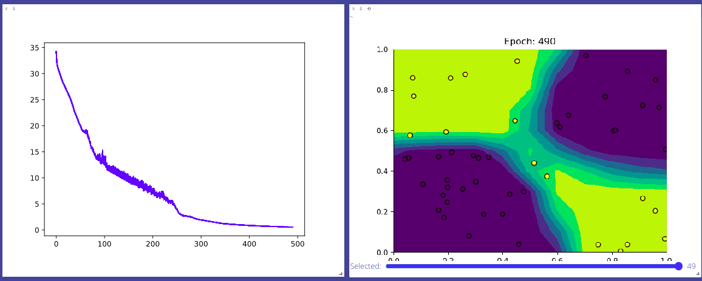

# MiniTorch Module 1  


* Docs: https://minitorch.github.io/

* Overview: https://minitorch.github.io/module1.html

This module requires `operators.py` and `module.py` from Module 0

```
cp ../Module-0/operators.py ../Module-0/module.py minitorch/
```


* Tests:

```
python run_tests.py
```
Configuración del entrenamiento

```
PTS = 50
DATASET = datasets.Xor(PTS, vis=True)
HIDDEN = 10
RATE = 0.5

```


Registro de entrenamiento
```
Epoch  0  loss  34.23367701392514 correct 31
Epoch  10  loss  29.304202396278807 correct 35
Epoch  20  loss  27.12411247679289 correct 37
Epoch  30  loss  25.025693483018067 correct 37
Epoch  40  loss  22.234273632256905 correct 39
Epoch  50  loss  20.03648725274366 correct 43
Epoch  60  loss  19.032367410808465 correct 43
Epoch  70  loss  17.0015148918288 correct 44
Epoch  80  loss  14.681997812671831 correct 45
Epoch  90  loss  14.53315559982747 correct 45
Epoch  100  loss  13.908523781379607 correct 45
Epoch  110  loss  12.350035817296183 correct 45
Epoch  120  loss  11.946484021210885 correct 45
Epoch  130  loss  11.50055513805136 correct 45
Epoch  140  loss  11.16053701375132 correct 45
Epoch  150  loss  10.258337723099412 correct 45
Epoch  160  loss  10.23211290957903 correct 45
Epoch  170  loss  9.481057373217325 correct 45
Epoch  180  loss  9.218857433918771 correct 45
Epoch  190  loss  8.242639334995252 correct 45
Epoch  200  loss  7.93223251487617 correct 45
Epoch  210  loss  7.066502958587908 correct 45
Epoch  220  loss  7.361996454648359 correct 45
Epoch  230  loss  6.18422569402493 correct 45
Epoch  240  loss  5.649926237508184 correct 45
Epoch  250  loss  4.017779106997091 correct 48
Epoch  260  loss  2.8401775524673125 correct 50
Epoch  270  loss  2.6257439533880174 correct 50
Epoch  280  loss  2.465561486093927 correct 50
Epoch  290  loss  2.102458946799692 correct 50
Epoch  300  loss  1.9150637366053433 correct 50
Epoch  310  loss  1.7596518886307557 correct 50
Epoch  320  loss  1.5875530834830465 correct 50
Epoch  330  loss  1.4519217375343916 correct 50
Epoch  340  loss  1.270870391766446 correct 50
Epoch  350  loss  1.1797158399657555 correct 50
Epoch  360  loss  1.0985016515521524 correct 50
Epoch  370  loss  1.0295293348085677 correct 50
Epoch  380  loss  0.9661988142573389 correct 50
Epoch  390  loss  0.909632151655527 correct 50
Epoch  400  loss  0.8591641762670343 correct 50
Epoch  410  loss  0.8151202464048595 correct 50
Epoch  420  loss  0.7707360448212239 correct 50
Epoch  430  loss  0.7330237663059941 correct 50
Epoch  440  loss  0.7038448214326283 correct 50
Epoch  450  loss  0.6714133611047655 correct 50
Epoch  460  loss  0.6415772070939127 correct 50
Epoch  470  loss  0.6055785070349236 correct 50
Epoch  480  loss  0.5790915649370875 correct 50
Epoch  490  loss  0.5605285985406321 correct 50

```